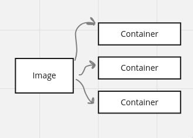

# Dive into Docker

## Why we use Docker

Docker makes easy to install software in your computer or server.
It's easy to run software, setup and dependencies.

For example when we have to install Redis

    docker run -it redis

## What is Docker

Docker is an entire ecosystem composed of:
- Docker client
- Docker Server
- Machine
- Images
- Docker Hub
- Docker compose

It is an ecosystem to create and running containers.

## What is a container ?

When I run the command 

    docker run

I am using the Docker CLI that calls the Docker Hub annd it downloads a single
file called Image.

The **Image** is a single file that contains all the dependencies and configuration required
to run a program

A **Container** is an instance of the Image. It runs a program.

A Container is a program with its own set of resources.
A Container has its owns isolated set of hardware, memory, disk space, network.

### Docker CLI -> Docker Server (Daemon)

The Docker Client doesn't actually do anything with images or containers.

It's a tool to help to interact with the Docker Server.
This is a tool responsible to 
- Create containers
- create images
- maintain containers
- running containers
