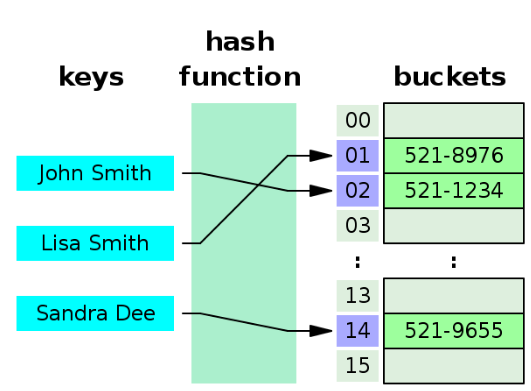

# HashTable

It is a data structure that uses an Hash Function to compute an index into an array of buckets
or slots from which the desired value can be found.

Ideally the has function will assign each key to a unique bucket, but most
hash table design employ an imperfect hash function which might
cause collision where the hash function generates the same index for more than one key.

In many situations hash tables are more efficient than 
search-trees or any other lookup table.

Given a key, the algorythm computes an index
that suggests where the entry can be found.

Often this is done in two steps:
- hash = hashfunction(key)
- index = hash % size_of_array

A good hash function and implementation algorythm
- are assential for good hash table performance

## Hash

An object is hashable if it has a has value that doesn't change during 
its entire lifetime.

All immutable objects and tuple, in Python, are hashable.

The mutable containers like **lists** or **dictionaries** are not hashable.

Objects which are instances of the user-defined
class are hashable by default, 
they all compare unequal, and their hash value is their id ().

## Lists, Sets and Hash

Set can't contain duplicates, and are unordered.

In order to find and element in a set, 
a hash lookup table is used, that's why sets are unordered.

This makes __contains__ (the "in" operator) a lot more efficient for sets than lists.

---

Sets can only contain hashable items, 
whilst instead lists can contain any type of objects.

That's why, again, lists are not hashable.

Sets are also unindexed: you cannot access items by referring to an index.

    TypeError: 'set' object does not support indexing

Sets are mutable

Sets uses hash function to find an element.

---

An object is hashable if it has an hash value that doesn't change during its entire lifetime.

Python has a built-in method:

    __hash__()
    __eq__()
    __cmp__()

to compare them and if the hashtable object are equal than they have the same hash value.

Again:

### All immutable built-in objects, and tuples, are hashable
### Lists and dictionaries are not hashable.

