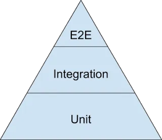
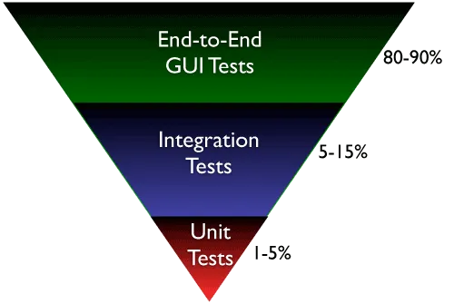
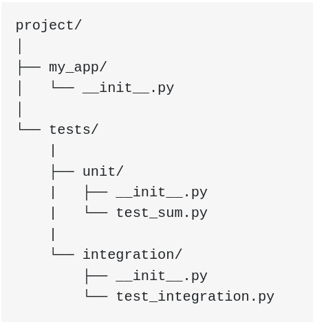

### THE TESTING PYRAMID

Most software organizations today already know about the “Testing Pyramid”.

Its essential point is that you should have many more low-level unit tests than high level 
end-to-end tests running through a GUI

As you move up the pyramid, your tests gets larger, 
but at the same time the number of tests (the width of your pyramid) gets smaller.

We can split percentage for each test parts,
for example: 50% unit test, 30% integration test, 20% e2e test

#### The Inverted Testing Pyramid (Ice Cream Cone)

Most software organizations today spend maximum time and effort to manually checking software. 
Some invest in automation, but mostly building slow, complex, fragile end-to-end GUI test. 
Very little efforts are spent on building a solid foundation of unit & integration tests.

They end up with majority (80–90%) of their tests being end-to-end GUI tests. 
Some efforts are spent on writing so-called “integration test” (typically 5–15%.) 
resulting in a shocking 1–5% of their tests being unit/micro tests.

**Why is this a problem?**

- The base of the pyramid is constructed from end-to-end GUI test, 
which are famous for their fragility and complexity. 
A small pixel change in the location of a UI component can result in test failure.

- Most teams struggle automating their end-to-end tests early on, which results in huge amount of 
time spent in manual regression testing

- Number of end-to-end tests required to get a good coverage is much higher and more complex than the
number of unit tests + selected end-to-end tests required.

- Maintain a large number of end-to-end tests is quite a nightmare for teams.

### Definitions

A unit test is a smaller test, one that checks that a single component operates in the right way.
A unit test helps you to isolate what is broken in your application and fix it faster.

- An integration test checks that components in your application operate with each other.
- A unit test checks a small component in your application.

### Tests with Pyhon

- unittest
unittest has been built into the Python standard library since version 2.1. 
You’ll probably see it in commercial Python applications and open-source projects.

unittest contains both a testing framework and a test runner. unittest has some important 
requirements for writing and executing tests.

**unittest requires that:**
- You put your tests into classes as methods
- You use a series of special assertion methods in the unittest.
TestCase class instead of the built-in assert statement

- pytest

pytest supports execution of unittest test cases. 
The real advantage of pytest comes by writing pytest test cases. 
pytest test cases are a series of functions in a Python file starting with the name test_.

pytest has some other great features:

- Support for the built-in assert statement instead of using special self.assert*() methods
- Support for filtering for test cases
- Ability to rerun from the last failing test
- An ecosystem of hundreds of plugins to extend the functionality

#### Side Effects
When you’re writing tests, it’s often not as simple as looking at the return value of a function. 
Often, executing a piece of code will alter other things in the environment, 
such as the attribute of a class, a file on the filesystem, or a value in a database. 
These are known as **side effects** and are an important part of testing. 
Decide if the side effect is being tested before including it in your list of assertions.

If you find that the unit of code you want to test has lots of side effects, 
you might be breaking the **Single Responsibility Principle**. 
Breaking the Single Responsibility Principle means the piece of code is doing too many
things and would be better off being refactored. 
Following the Single Responsibility Principle is a great way to design code 
that it is easy to write repeatable and simple unit tests for, and ultimately, 
reliable applications.

A way to test:

- This will execute the same test module (called test) via the command line.
with the option "verbose"

    python -m unittest -v test

Instead of providing the name of a module containing tests, 
you can request an auto-discovery using the following:
    
    python -m unittest discover

Once you have multiple test files, as long as you follow the test*.py naming pattern, 
you can provide
the name of the directory instead by using the -s flag and the name of the directory:

    python -m unittest discover -s tests

Lastly, if your source code is not in the directory root and contained in a subdirectory, 
for example in a folder called src/, you can tell unittest
where to execute the tests so that it can import the modules correctly with the -t flag:

     python -m unittest discover -s tests -t src

unittest will change to the src/ directory, scan for all test*.py 
files inside the the tests directory, and execute them.

#### Handling Expected Failures

There’s a special way to handle expected errors. You can use .assertRaises() as a context-manager, 
then inside the with block execute the test steps:

        def test_bad_type(self):
            data = "banana"
            with self.assertRaises(TypeError):
                result = sum(data)

### Mocks
Mocks are another important part of unit testing. Because we are only testing a single unit of code,
we don’t really care about what other function calls do. We just want to have a reliable return 
from them.

    def initial_transform(data):
      """
      Flatten nested dicts
      """
      for item in list(data):
          if type(data[item]) is dict:
              for key in data[item]:
                  data[key] = data[item][key]
              data.pop(item)
  
      outside_module.do_something()
      return data

We don’t want to make live calls to do_something() so instead we’ll make a mock in our test script.
The mock will catch this call and return whatever you set the mock to return.

    @pytest.fixture(params=['nodict', 'dict'])
    def generate_initial_transform_parameters(request, mocker):
      [...]
      mocker.patch.object(outside_module, 'do_something')
      mocker.do_something.return_value(1)
      [...]

Now every time you call initial_transform, the do_something call will be intercepted and return 1

One last neat trick is to use side_effect. 
Among other things, this allows you to mock different returns
for successive calls to the same function:

    def initial_transform(data):
    """
    Flatten nested dicts
    """
    for item in list(data):
        if type(data[item]) is dict:
            for key in data[item]:
                data[key] = data[item][key]
            data.pop(item)

    outside_module.do_something()
    outside_module.do_something()
    return data

We’d set up our mock like so, with a list of outputs (for each successive call) passed to side_effect:

    @pytest.fixture(params=['nodict', 'dict'])
    def generate_initial_transform_parameters(request, mocker):
    [...]
    mocker.patch.object(outside_module, 'do_something')
    mocker.do_something.side_effect([1, 2])
    [...]

----

## Writing Integration Tests

Integration testing is the testing of multiple components of the application to check that they work together. Integration testing might require acting like a consumer or user of the application by:

- Calling an HTTP REST API
- Calling a Python API
- Calling a web service
- Running a command line

Each of these types of integration tests can be written in the same way as a unit test, 
following the Input, Execute, and Assert pattern. 

The most significant difference is that integration tests are checking more components 
at once and therefore will have more side effects than a unit test. 

Also, integration tests will require 
more fixtures to be in place, like a database, a network socket, or a configuration file.

This is why it’s good practice to separate your unit tests and your integration tests.

The creation of fixtures required for an integration like a test database and the test cases 
themselves often take a lot longer to execute than unit tests, so you may only want to run 
integration tests before you push to production instead of once on every commit.

